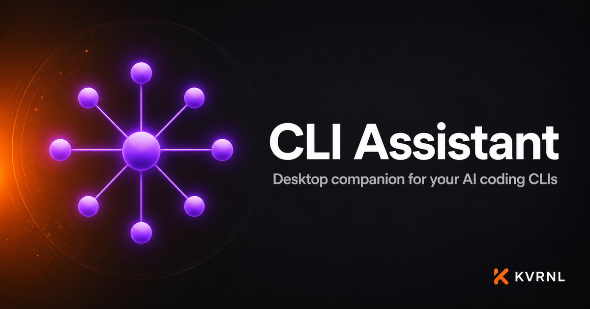

# CLI Assistant

### Desktop companion for your AI coding CLIs

 

Stay connected to your AI coding sessions without being chained to the terminal. Notifications, session management, and an AI chat dock — all in one lightweight desktop app.

### **[⬇&nbsp; Download CLI Assistant — free at kvrnl.io](https://kvrnl.io/products/cli-assistant/)**

 

---

## What it does

CLI Assistant keeps you plugged into your AI coding CLI sessions (Claude Code, Codex, and more) from a clean desktop app, so you can step away from the terminal without losing the thread. Get live session monitoring, desktop notifications you can reply to inline, and an AI chat dock with persistent memory.

It runs quietly in the background, updates itself silently, and stays out of your way until you need it. Free to use — claim your license key and download it straight from this page.

## Features

- **Live session monitoring and autopilot**
- **Desktop notifications with inline responses**
- **Assistant AI chat with persistent memory**
- **Auto-updating with silent installs**

## Download &amp; install

CLI Assistant is **completely free**. Each install needs its own license key, which you get
with a free KVRNL account.

1. Go to **[kvrnl.io/products/cli-assistant/](https://kvrnl.io/products/cli-assistant/)**
2. Create a free account — email verification, nothing else
3. Claim your license key — instant, no waiting
4. Download and install

> [!NOTE]
> CLI Assistant isn't code-signed yet, so Windows SmartScreen may warn you on first run.
> Click **More info → Run anyway**. Code signing is on the roadmap.

## Your license key

- **Free, one per product**, issued from your KVRNL account.
- **A key activates on one machine.** The first device to activate it claims it.
- **Switching computers?** Hit **Release device** on your
  [account page](https://kvrnl.io/account/) and the key is free to use again.
- Keys are checked over HTTPS at launch. See [Privacy](#privacy).

## Requirements

- **Windows 10 or 11** (64-bit)
- A free [KVRNL account](https://kvrnl.io/signup/) for your license key

## Privacy

CLI Assistant sends KVRNL only what's needed to validate your license: **the key, the
product name, and a hardware ID**. No telemetry, no analytics, no tracking, and
none of your files. Full policy: **[kvrnl.io/privacy](https://kvrnl.io/privacy/)**

## What's new

**v2.5.16** — 2026-09-25
  - Clicking the tray icon now opens a mini control center: your status at a glance, your live sessions, anything waiting on you, quick switches for the floating widget, sounds and Autopilot, plus New Session, Control Panel, Settings and Exit. Left-click and right-click both open it; double-click still opens the full window.
  - You can pin the control center anywhere on your screen. Drag it by its top bar and let go, or click the pin icon. A pinned panel stays on top and keeps its spot through restarts and updates until you unpin it.
  - Fixed the header getting stuck on "Updating to..." after an update that didn't finish.

**v2.5.15** — 2026-09-05
  - Short questions from Claude now trigger a popup. Quick confirmations like "Should I proceed?" or "Go ahead?" were being ignored because they were under a 30-character minimum, so you could be left waiting at the terminal without knowing Claude had asked something.
  - Fixed one session's popup being killed by another. With two Claude sessions open, a question from one could close the other's popup mid-display, and that session would move on as if you'd never answered.
  - Fixed popups failing to appear when the message started with a dash — for example a bulleted list of options, or a message beginning with a negative number.
  - The native crash log now follows your chosen data folder like everything else, so it's included when you send diagnostics.

**v2.5.14** — 2026-08-18
  - Downloads and automatic updates now come straight from KVRNL's own servers instead of a third-party host. Updates are quicker and more reliable, and nothing inside the app itself has changed.
  - If you installed this app before today, please download it once more from kvrnl.io. Older copies still look for updates at the old location and can't carry themselves across the move — this one time has to be done by hand.

**v2.5.11** — 2026-08-05
  - Fixed CLI Assistant being flagged by Windows Defender and other antivirus software. Nothing was ever wrong with the app — a few of the ways it did ordinary things just happened to look like the way malware behaves, and this release changes all of them.
  - Voice notifications no longer write a temporary script file to your system and run it through PowerShell — the biggest cause of the false alarms. Speech now runs entirely in memory.
  - The app's own updater and the one-click installers for Git, Obsidian, Claude Desktop and Node.js now download into CLI Assistant's own folder instead of your Windows temp folder, and no longer launch hidden.
  - CLI Assistant.exe now carries proper Windows file details (publisher, product name and version), which it was previously missing.

**v2.5.10** — 2026-07-08
  - New: a per-CLI Desktop Popups picker in Settings — connect Claude Code, Codex, and Copilot individually so the CLIs you use can raise desktop popups through CLI Assistant.
  - Fixed the Settings provider/model dropdowns — scrolling the page no longer accidentally changes the selection.

Full history → **[kvrnl.io/changelog/cli-assistant](https://kvrnl.io/changelog/cli-assistant/)**

## Documentation

Setup guides and how-tos → **[kvrnl.io/docs/cli-assistant](https://kvrnl.io/docs/cli-assistant/)**

## Support

> [!IMPORTANT]
> **We don't use GitHub Issues.** Report bugs from inside the app — it's the
> fastest route to us and it attaches the details we need automatically.

- 🐛 **Found a bug?** Use **Report a Problem** inside CLI Assistant
- 💬 **Chat with us** → **[Discord](https://discord.gg/Ub4SdAuhu)**
- ✉️ **Anything else** → **[kvrnl.io/contact](https://kvrnl.io/contact/)**
- ❓ **FAQ** → [kvrnl.io/faq](https://kvrnl.io/faq/)

## License

**Proprietary freeware — free to use, not open source.**

This repository hosts the installer releases, documentation, and license for
CLI Assistant. **The application source code is not published.** See
**[LICENSE](./LICENSE)** for the full terms.

---

 

**[kvrnl.io](https://kvrnl.io)** &nbsp;·&nbsp; **[All products](https://kvrnl.io/products/)** &nbsp;·&nbsp; **[Changelog](https://kvrnl.io/changelog/)** &nbsp;·&nbsp; **[Discord](https://discord.gg/Ub4SdAuhu)** &nbsp;·&nbsp; **[Contact](https://kvrnl.io/contact/)**

© 2026 <b>KVRNL</b> — an AI-powered software studio shipping free desktop tools.

